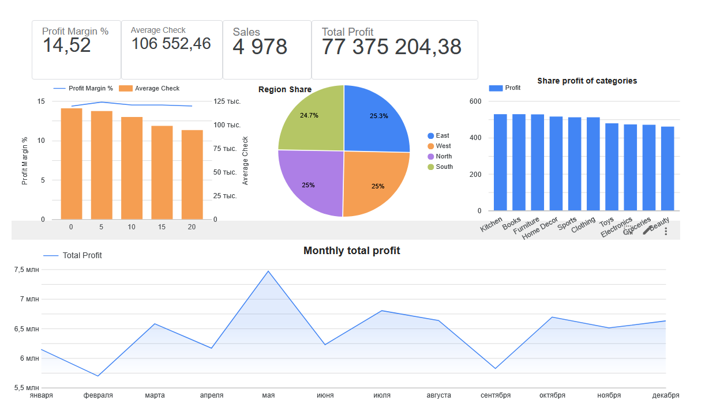

# E-commerce Sales Analysis (2023–2025)

SQL-based sales analytics project — from raw transactional data to an interactive dashboard and a structured business report.

## Key Findings

- **Stable, self-funding business**: 15% average margin on a ~533M total revenue base, with no major structural weaknesses across categories, regions, or payment methods.
- **Near-zero repeat-purchase rate**: ~5,000 orders across ~4,844 customers — the business runs almost entirely on new-customer acquisition, not retention.
- **Beauty is the weakest category**: lowest order volume, fewest customers, and the only margin one point below the rest (14% vs. 15% elsewhere).
- **Discounts above 15% don't pay off**: the 20% discount tier produces the lowest total sales and lowest margin of all tiers — deeper discounts aren't buying more volume.

**[→ Read the full report (PDF)](./report/E-commerce_Sales_Analysis_2023_2025.pdf)** &nbsp;|&nbsp; **[→ Open the live dashboard (Looker Studio)](https://datastudio.google.com/reporting/828ef23e-b333-4791-b634-35ed35476d5c)**

## What's in this repo

| Folder | Contents |
|---|---|
| `/sql` | All SQL queries used to produce every table in the report (one file per analysis section) |
| `/report` | Full written report — PDF, with insights and recommendations after every table |
| `/dashboard` | Dashboard screenshot + link to the live interactive version |

## Tools

SQL (SQLite) &middot; DBeaver &middot; Looker Studio

## Data Source

Public e-commerce sales dataset sourced from [Kaggle](https://www.kaggle.com/datasets/prince7489/e-commerce-sales) — used for portfolio/practice purposes, not proprietary company data.

## About this project

Built as an independent portfolio project to practice the full analyst workflow: writing SQL from a raw transactions table, structuring the results into a reporting-ready layout, building a dashboard on top of the same metrics, and writing up findings and recommendations the way I would for a stakeholder.
